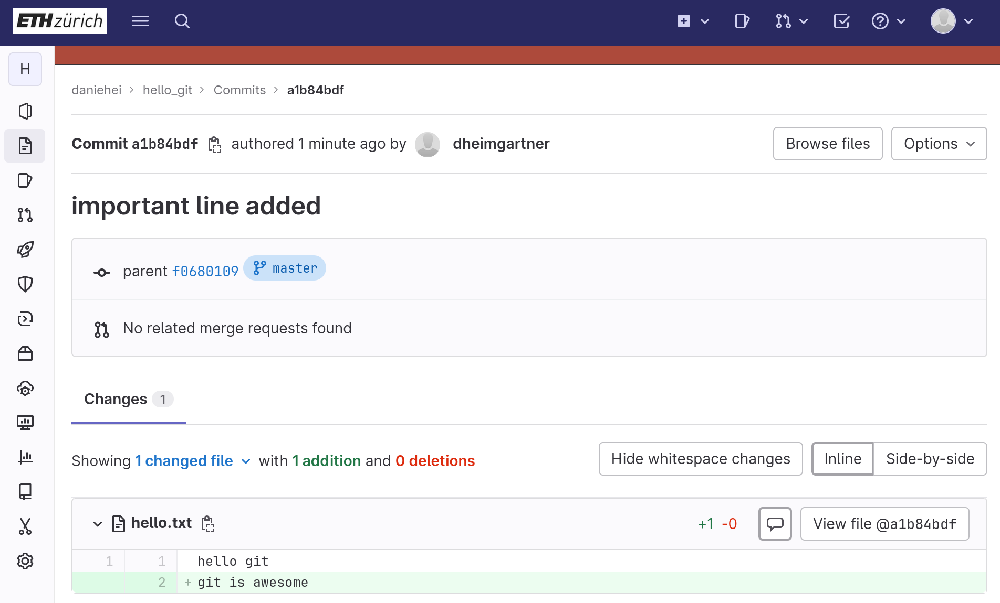
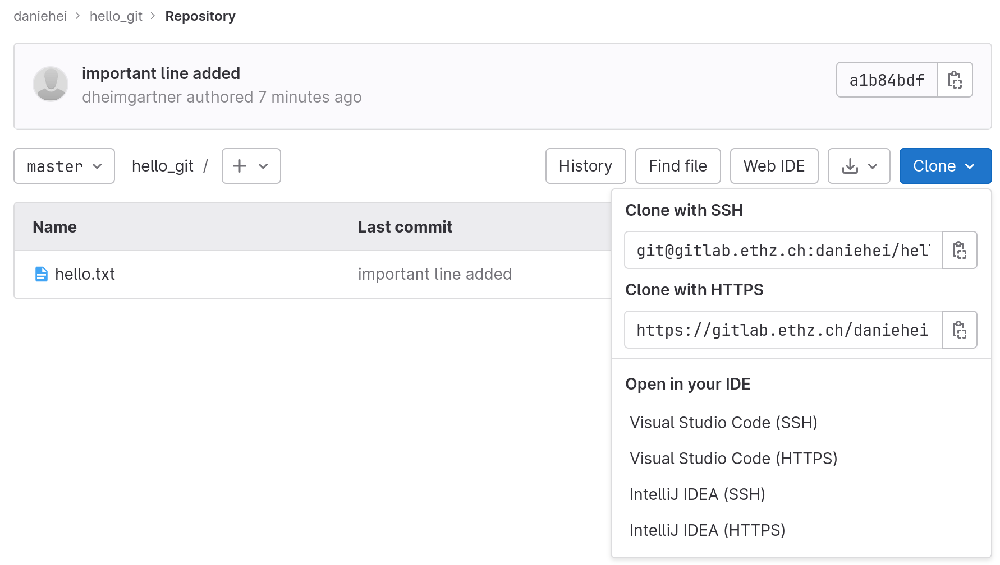

# Technical Tools


## Prerequisites

For this introduction you need the following software:

- [Python](https://www.python.org/) (python3)
- [Visual Studio Code](https://code.visualstudio.com/)
- [git](https://git-scm.com/)
- [PostgreSQL](https://www.postgresql.org/)


## Motivation

We would like to help you establish (what we think) good practices in data management and programming/scripting. Therefore we use (and partially enforce the use) of the following tools in this exercise series:

- `git` version control and `GitLab` (to collaborate on code)
- `PostgreSQL` database management
- `Visual Studio Code` IDE (of course, you are free to use any editor you like - extra points for emacs or Vim users ;)
- `Python`, `pip` and `venv` (virtual environments, you may also use conda if you prefer)

This document introduces these tools and hints to additional resources. We know, it is a lot to take in at once. But you can use this document as a reference for the course. Apart from the Python code that you will have to write to conduct the analysis, you should find a simple example for every command (of the other tools) that we need in this course which you can slightly adjust to suit your needs.

Data and software literacy should be an integral part of any academic (hard science) education. We would like you to get acquainted with some of the most frequently used tools where you hopefully experience their power throughout the hands-on exercise series.

Let me explain to you why we need these tools in the context of this lecture: You will have to conduct simple data analysis and perform optimizations which requires you to code in [`Python`](https://www.python.org/) (one of the most popular programming languages).

Python can be learned relatively easily (read the [docs](https://www.python.org/doc/)). As with any programming language, you should familiarize yourself with the basic building blocks of the programming language, which include:

- Data types (e.g. integer, string, Boolean)
- Variables
- Operators (e.g. arithmetic, comparison, logical)
- Control structures (e.g. if-else statements, loops)
- Functions or subroutines
- Input/output statements
- Comments

These building blocks can be combined to create statements and expressions, which are then used to write programs (I've asked [ChatGPT](https://chat.openai.com/chat) to write down these basic building blocks).

Anyways, understanding these blocks is relatively simple and the power of using a language usually comes from its package ecosystem. A `package` is a collection of code (usually functions or objects and methods) which provide domain functionality (e.g. the [`pandas`](https://pandas.pydata.org/) package which provides powerful data analyis tools such as the `pandas.DataFrame` object and its associated methods). When learning how to use that functionality, it is not so much about learning complicated coding but simply about reading the documentation and understanding what function/method accomplishes what and what arguments you need to feed (more on this in the [Getting help](#getting-help) section).

> A sidenote on packages: You should not feel intimidated to write your own packages. A package (in any programming language) is just a conveniently structured repository following given conventions. You are welcome to learn more by following this [simple tutorial](https://packaging.python.org/en/latest/tutorials/packaging-projects/) on how to write a minimal package in Python.

We will learn how to easily install packages with `pip` - the Python package manger. Every analysis should be reproducable, i.e. anyone should be able to arrive at the same output given the input (i.e. raw data) preferably on any system (e.g. mac, windows, linux). Therefore we want to encapsulate our environment such that it is easily portable and can be shared with others (students, researchers, the public, etc.). For this purpose we install the packages into so-called *virtuel environments* (`venv`).

On the note of reproducibility: You yourself sometimes are not sure what your alter ego did. (Automatically) documenting the different stages of your development and project work therefore makes sense. Further, you sometimes do something wrong or want to revert your work to a previous state. Therefore a version control system (`git`) is a very powerful tool. It also allows you to collaborate effectively, without having to worry to overwrite your colleagues state of work!

[`GitLab`](https://about.gitlab.com/) is just the hosting platform where you can mirror your local project structure and share your work with the world (or with us for grading).

Sooner or later, you will realize that sharing and managing (raw) data with `.csv` files or other formats is very cumbersome. For example, a .csv file lives only on the local computer and if you want to share it you have to physically copy and share the file (that is the data gets duplicated). Or have you ever (tried) to open an excel spreadsheet containing some GB of data just to get a feel for what it actually contains? As you will individually collect your raw data for the analysis (through surveying bus users) and share it with the rest of the class, we will use `PostgreSQL`. The database will be hosted on a server and therefore we can easily pull/access the data in our Python scripts with help of the `psycopg` Python package.

> Of course you can also run a Postgres DB on your local computer and organize your personal data without the need of a server (a server is just a computer system attached to a network).

[`Visual Studio Code`](https://code.visualstudio.com/) is just an *Interactive Development Enviornment*, i.e. a text editor with superpowers such as syntax highlighting, autocompletions, syntax highlighting, signature help, integrated REPL, etc. You are free to use another one you like (for exmample PyCharm is another popular choice). While *Jupyter Notebooks* are very neat, they have some limitations in data analysis (for example code output and chronology of ran cells gets stored in the very file which makes it difficult to version control). Personally, I have a preference for general purpose tools such that you do not have to learn/use a new environment when you switch the language...

But let's get started!


## Getting on the same page

> Potentially have to add ssh...

1. Fire up a terminal running `bash` or the `zsh` (on windows use [Git BASH](https://gitforwindows.org/))
2. Check that git is installed and see some of the commands that we will use later: `git --help`
3. Create a repository on your root and switch to it `cd ~ && mkdir gitlab && cd gitlab`
4. Get this PuvIntro repository (i.e. `clone` it from gitlab) `git clone git@gitlab.ethz.ch:daniehei/PuvIntro.git`
5. Open vscode (`code .`) and click on the README file.
6. Open up a terminal inside vscode with `Ctrl+Shift+P` (opens the command palette) and type terminal and hit `Enter`.
7. Create a virtual environment called *env* with `python3 -m venv env`.
8. Install the Python extension.
9. Tell vscode to use the newly created env when interpreting Python code: `Ctrl+Shift+P`, type `Python: Select interpreter` and choose the before created `env`.
10. Make sure the env is activated `source env/bin/activate` (or open a new terminal as described above).

Your prompt should look something like this (note the `(env)` before `usr@hostname`):

```
(env) daniehei@ivt-thinkpd-85:~/Teaching/PuV/2023/PuvIntro$
```

By the way, the `PuvIntro` is structured as a Python package:

```
.
├── LICENCE
├── pyproject.toml
├── README.ipynb
├── README.md
└── src
    └── greatest_package
        ├── greetings.py
        ├── __init__.py
```

11. Therefore we can install it locally with `pip install -e .`
12. The PuvIntro package provides a very useful functionality
    - Start the Python interpreter `Python`
    - `from greatest_package import greet`
    - `greet.daniehei_greets()`
13. For illustration, this project also uses some dependencies as listed in the `requirements.txt`
    - Install them with `pip install -r requirements.txt`
14. Open the file (module) `greetings.py` and extend it with a function that prints a greeting message (use your eth-username to name the function as otherwise we might end up with several functions having the same name).
15. Add your version of the script with `git add .`
16. Commit with a meaningful message `git commit -m "best commit ever"`.
17. Push the commit to the gitlab repository (to make it available to others) `git push`.
18. Pull the updated project `git pull`.
19. You can inspect all the great commits with `git log` (or tools such as `lazygit`).
20. Fire up a Python interpreter and try out the different functions.

### Summary

We have cloned the repository `PuvIntro` which is hosted on my gitlab page (i.e. we made a local versioned copy of it). Subsequently, we've created a virtual environment and told our IDE to use it when interpreting Python code. We could conveniently explore the functions by locally installing our package. We have installed all the dependencies that would be required to run our code from the `requirements.txt` file. That is, we are all on the same page: We all have the same version of the PuvIntro project and this project is evaluated in the exactly same environemnt (Sideremark: maybe you have a slightly different python3 version, but this does not matter for now). We then extended the project's functionality and made it publicly available on gitlab. This allows others to leverage the functionality and explore the project evolution and contribute to your code without messing it up with help of `git`. So the full cycle is (clone), pull, change a bit, commit meaningful chunks, push, restart the game, ...

This was a high level introduction of the basics. We now introduce each aspect in more detail as well as ellaborate a bit on PostgreSQL.


## Python

This is not a language introduction. If you struggle with the language itself, please find a strategy to update your knowledge - there are tons of very good (and free) resources online.

### Getting help
<a id="getting-help"></a>

As already mentioned, the official documentation is always the best reference. However, there are additional tools to get the gist of a programme respectively its functionality. As you might have realized one of the dependencies that we've installed from the requirements was pandas. Here are some strategies to understand this library:

- `help(pandas)`
- `dir(pandas)` (if you don't understand what `dir` does then type `help(dir)`)
    - Ok, so there is a `DataFrame` object provided... What is it though? `help(pandas.DataFrame)`
        - Hint: You can scroll the document with the Vim-keys j and k and you can search for keywords like so `/keyword`.
        - Similarly: What can we do with the DataFrame? `dir(pandas.DataFrame)`
            - Aha, there is a filter `method`. But what can it do? `help(pandas.DataFrame.filter)`
            - Remark: Why is it not the same as simply typing `help(filter)`?

> This documentation is automatically generated because the maintainers of the code added `docstrings` to their code (which you definitively should do as well!) Also, it is good practice to add `type hints` (see greetings.py -> daniehei_greets for an example).

- Check out the file `ide_demo` which showcases the power of an IDE and allows you to jump directly to the definition in the source code.
- You can get pretty much the same experience by going to the reference section of the [official documentation](https://pandas.pydata.org/docs/). There you additionally a gettings started guide and some other stuff which might help you get started.
- We all heard of it: You might want to ask [ChatGPT](https://chat.openai.com/chat) for help. I strongly encourage you to try it out! The more precisely you can frame a question, the more helpful the answer. For example: *Mighty chatbot, how can I find out about implemented classes, methods and functions of a Python package?*
- Google
- [stackoverflow](https://stackoverflow.com/). However, you should be critical with the snippets that users provide and not simply copy paste without understanding what the code does...
- Youtube (there it is important to find the right tutor: I find [Corey Schafer](https://www.youtube.com/@coreyms) very helpful. He also has a *Pandas Tutorials* and *Matplotlib Tutorials* playlist which you might find useful).


## venv

[venv](https://docs.python.org/3/library/venv.html) is just a Python module (it comes shipped with your Python installation) which allows you to create encapsulated (independent set Python packages installed in their own directory). There are only three commands you should know:

```bash
# Init new venv
python3 -m venv /path/to/new/environment

# For example if you want to init a new venv called env at the current location
python3 -m venv env

# Activate the env (on Mac or Linux)
source env/bin/activate

# On Windows
...

# Deactivate
deactivate

# On Windows
...
```


## pip

[pip](https://pypi.org/project/pip/) is the Python package manager. You can read throught the [Getting Started](https://pip.pypa.io/en/stable/getting-started/) guide at your leasure. I focus on the key commands that you should know. The basic usage is `pip install package`. However, this installs the package to the system's Python site-packages directory (so globally). If you have several Python versions installed (e.g. on linux you usually have both python2 and python3) then it is not clear to which Python version the pip command installs to as pip as well as pip3 are associated with one particular Python version. So therefore I would suggest that you call pip as a module starting with your preferred Python version like so:

```Python
python3.8 -m pip install package
```

Update a package (for example pip) with the following command:

```Python
python3.8 -m pip install --upgrade pip
```

Once you have activated the virtual environment, there is no need to call pip as a module. You can simply use `pip install package`.

You can list installed packages with `pip list`. If you want to make your environment reproducable, you can write the current state to a `requirements.txt` file like so:

```bash
pip freeze > requirements.txt
```

Remark: The `>` operator pipes the output of the LHS into the file on the RHS.


## Git version control

> Please read the first three chapters of the [git Book](https://git-scm.com/book/en/v2). It takes maybe 30-60 minutes and I promise you, knowing a little about git will serve you well not only in this course!

Git knows the state of each file in your git repository! But not only that, it also remembers all the previously commited stages. It knows the differences of all these stages and they are easily recoverable. Let's explore and explain some of its core functionality:

```bash
# Change directory (~ stands for your home directory)
cd ~/gitlab

# Create an exmaple directory
mkdir hello_git && cd hello_git

# Init current directory (.) to be a git repository
git init .

# See: this added a hidden .git repository
ls -a

# Add a file (you can also use a text editor)
echo "hello git" > hello.txt

# Check the status
git status

# (if you are using a venv called env do not include the env repo in git tracking)
echo "env" > .gitignore

# Add the newly hello.txt file to be tracked (i.e. versioned)
git add hello.txt

# Check what happened - read the output!
git status

# Commit with a meaningful message
git commit -m "just testing"
```

So far in this example, we've only worked on our local machine. What if we want to collaborate and share our code? We first have to initialize a (remote) gitlab repository.

1. Navigate to https://gitlab.ethz.ch/projects/new
2. Click *Show command* and copy it
3. Go back to your terminal and paste it (make sure to be in the `hello_git` repository) and execute
4. See: your local repository has been mirrored on gitlab: https://gitlab.ethz.ch/daniehei/hello_git (replace daniehei with your username)

Now the git cycle starts from before. Let's say we want to append a line in in hello.txt

```bash
# >> appends whereas > would overwrite
echo "git is awesome" >> hello.txt

# Print file to standard output (i.e. to your console)
cat hello.txt

# Again check the current status
git status

# Ok, hello.txt was modified. But what did we actually do?
git diff

# Great, we want to commit this change
git add hello.txt
git commit -m "important line added"

# Let's broadcast this to the world
git push
```
Check your gitlab repository and explore the GUI (graphical user interface) functionality! For example, navigate to *Commits* and click on *important line added*.



if you want to share your repository you need to navigate to clone and copy the link (e.g. git@gitlab.ethz.ch:daniehei/hello_git.git):



```bash
# Let's remove our local repository (assume your computer cuaght fire)
cd ~/gitlab
rm -rf hello_git

# And clone the remote repository
git clone git@gitlab.ethz.ch:daniehei/hello_git.git

# See it is here again
ls
```

In the meantime, your colleague might change something and push it to the gitlab repository. Before you start working on your local machine, check whether there have been any updates! Do so by `git pull`.

### Summary

- This seems like a lot to remember... `git --help` might help
- The most important commands are:
    - `git init`: Initialize a git repository
    - `git status`: Check the current status
    - `git add file` or `git add .`: Add files or changes to files (the latter adds everything in the current (`.`) directory)
    - `git commit -m "message"`: Commit the changes with a meaningful message (it's an art to write meaningful commit messages, just write what you did and avoid messages like *changed stuff*)
    - `git push`: Push changes to remote (in our case gitlab)
    - `git clone link`: Clone remote repository
    - `git pull`: Pull potential changes from remote
- Please read the first three chapters of the [git Book](https://git-scm.com/book/en/v2).

> If you are overwhealmed with all this command line awesomeness you may want to use a GUI tool such [GitHub Desktop](https://desktop.github.com/). However, I would encourage you to embrace the command line! :) The commands discussed so far, can take you very far! If you would like to learn more this might be a good [starting point](https://www.learnshell.org/). The terminal is just an interface to interact with our computer. Inside the terminal you can run different shells: This is usually `bash` or `zsh` (which are very similar at our level of understanding)... If you are a Mac user, you might want to explore the [brew](https://brew.sh/) package manager to install and manage software (for example try to install lazygit). On Windows there is a similar package manager such as [chocolatey](https://chocolatey.org/). Linux uses `apt` or similar tools.


## PostgreSQL

Fed up with duplicating `.csv` files and send data via mail attachments and wait for large spreadsheets to load in Excel? Then it is time to learn a little bit about [PostgreSQL](https://www.postgresql.org/). We are here only touching on the bare minimum to accomplish our task. So what are we going to do?

You will collect customer survey data on different buslines in Winterthur (an Origin-Destination survey: Who does travel with a particular bus from where to where and why?). Each group will ride on a different busline (potentially on different days). However, every group will have to analyse all the buslines. So how will we do it? One strategy would be that each of the groups digitizes the data collected by paper and pencil. One poor soul (= one of us research assistants) would then have to collect these individual spreadsheets and consolidate the data into one master file. This file would then be distributed to the students, that is each student would have a copy of it on their local machines (all the data is multiplied). Oh no, I've made a mistake in the consolidation: Resend the corrected master file to all the students... We can do better than this and host the data at a generally (by you students) acessible server.

> As already mentioned, you can of course also run a postgres server on your local machine. You are encouraged to try setting a DB up on your local computer.

Check out the following `sql` script (you find it under `PuvIntro/sql/example.sql`).

```sql
-- Fresh start
DROP TABLE IF EXISTS daniehei;

-- Init table
CREATE TABLE daniehei(
	NAME varchar PRIMARY KEY,
	AGE smallint
);

-- Copy from file
\copy daniehei( NAME, AGE ) FROM '~/gitlab/PuvIntro/sql/daniehei.csv' delimiter ';' CSV HEADER;
```

You literally understand what it does from the syntax: It drops the table *daniehei* if it already exists and then creates (re-initializes) the table *daniehei* which has two columns *name* and *age*. The *name* column is of type `varchar` and is our primary key (every table should have a primary key) and the *age* column is of type `smallint`. You can read all about the available data types in the official documentation [here](https://www.postgresql.org/docs/current/datatype.html). Finally, we populate the data by copying it from the `daniehei.csv` which is just a plain .csv looking like this:

```csv
name;age
Daniel;30
```

But how do we actually execute the script? For this, I have written a simple bash script that helps you run it. Don't worry, all you have to do in the exercise is specifying the sql script and I will show you how to run it.

> Remark: You could also achieve the same thing (i.e. initialize and populate the table) all from within Python with the `psycopg` package. But we thought it would be illustrative to use the actual sql syntax to do it. If you want to follow the pythonic way, [this]([psycopg](https://www.psycopg.org/psycopg3/docs/basic/usage.html) link gets you started.

To run the script you can issue the following command:

```bash
cd sql

# Enter your pw when prompted
sh run_sql.sh username example.sql
```

If you are interested please try to understand the `run_sql.sh` script.

### psycopg

Now we can easily communicate with the DB from our Python scripts with help of [psycopg](https://www.psycopg.org/psycopg3/docs/basic/usage.html). See the `query_example` from the `greatest_package.postgres` module for an example. Make sure to understand it!

```python
from greatest_package import postgres as pg

# Check out the documentation of the function to pass the appropriate arguments
pg.query_example()
```


## Exercise

1. Initialize a new empty repository in your `~/gitlab/` main repo.
2. Initialize the repository to be a git repository.
3. Write an sql script that initializes a new table called `<your eth-abbr>_message` containing only one column `message` and populate it with one secret message.
4. Commit the newly created script and add a meaningful commit message.
5. Try to implement the Python package repository structure as in `PuvIntro` or follow this [tutorial](https://packaging.python.org/en/latest/tutorials/packaging-projects/).
6. Write a function that queries the newly created table (with `psycopg`) and prints a message stored in the message table.
7. Commit your awesome package
8. Initilaize an new gitlab repository (hint: just navigate to *Create new project* https://gitlab.ethz.ch/projects/new and copy paste the code that pops up when you click *Show command* - you can paste the command into your terminal and execute it).
9. Share your code with the message recipient.
10. Clone someone elses awesome package and try to call the function printing the secret message.
